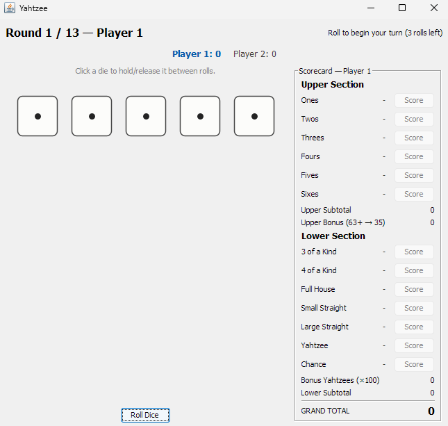

# Yahtzee

A Java implementation of Yahtzee with a Swing GUI: a player-count picker
that supports 1-6 players, a 13-round turn-based
game loop, dice you can hold between rolls, a live scorecard with score
previews, a running scoreboard across all players, upper-section and
bonus-Yahtzee scoring, and a JUnit 5 test suite covering the scoring
engine and game rules.



## How the game works

When the app starts, you choose how many people are playing (1 to 6) and
enter each player's name. Players then take turns in the order entered.
On a turn, a player gets up to 3 rolls of the 5 dice. Between rolls, any
die can be "held" (click it) so it keeps its value instead of re-rolling.
Once a player is satisfied with their hand - or has used all 3 rolls -
they commit that roll's score to one of the 13 open categories on their
scorecard. A category can only be used once per game; if the dice don't
qualify for a chosen category, it simply scores zero there.

A round only advances once every player has taken a turn in it. After 13
rounds, every player has filled out their entire scorecard, and the one
with the highest grand total wins (ties are announced as a tie). The
grand total is the sum of:

- **Upper section** (Ones through Sixes): number of matching dice times
  the face value, plus a 35-point bonus if the upper section subtotal
  reaches 63 or more.
- **Lower section**: 3/4-of-a-kind (sum of all 5 dice), Full House (25),
  Small Straight (30), Large Straight (40), Yahtzee (50), and Chance (sum
  of all 5 dice) - plus 100 bonus points for every Yahtzee rolled after
  the first one has already been scored.

## Project structure

```
yahtzee/
├── pom.xml
├── README.md
└── src/
    └── yahtzee/
        ├── Main.java            entry point - collects player count and names, then launches the GUI
        ├── Dice.java            a single die: its value and held state
        ├── DiceHand.java        scoring engine that evaluates a hand of 5 dice
        ├── ScoreCategory.java   the 13 scorecard categories
        ├── ScoreCard.java       one player's used categories, bonuses, and totals
        ├── Player.java          a player's name and scorecard
        ├── Game.java            turn/round progression across any number of players, rolls, holds, and scoring
        └── ui/
            ├── GameWindow.java      main window: dice, scoreboard, current player's scorecard
            ├── DiePanel.java        hand-drawn, clickable die widget
            └── ScoreCardPanel.java  scorecard grid with live score previews
test/
└── yahtzee/
    ├── DiceHandTest.java     scoring rules for every category
    ├── ScoreCardTest.java    bonus thresholds and running totals
    └── GameTest.java         turn order, rolls-per-turn, and round progression, including multi-player rotation
```

## How to build, run, and test

This project is set up as a standard Maven project.

```bash
# Run the GUI
mvn compile exec:java

# Run the test suite
mvn test

# Build a runnable jar
mvn package
```

If you don't have Maven, the game itself has no external dependencies and
can be compiled and run with just the JDK (the JUnit tests need Maven, or
a manually-added JUnit jar):

```bash
# from the project root
javac -d out $(find src -name "*.java")
java -cp out yahtzee.Main
```

Requires JDK 17+ (Swing, enums, and `java.util.Random` - nothing exotic,
so JDK 11+ likely works too if you lower `maven.compiler.source` in
`pom.xml`).

## How to play

1. When the app starts, choose how many players are sharing this game
   and enter each player's name.
2. On your turn, click **Roll Dice** - you get up to 3 rolls.
3. Between rolls, click any die to hold it (it turns gold) so it won't
   re-roll. Click again to release it.
4. Once you're happy with your hand, click **Score** next to any open
   category in your scorecard. The number shown is a live preview of
   what that category is worth right now.
5. Play passes to the next player automatically. The scoreboard at the
   top always shows every player's running total, with the active
   player's name highlighted, and the scorecard panel switches to show
   whoever's turn it currently is.
6. After every player completes all 13 rounds, the window announces the
   winner (or a tie) with everyone's final scores, and offers to start a
   new game with the same players.
